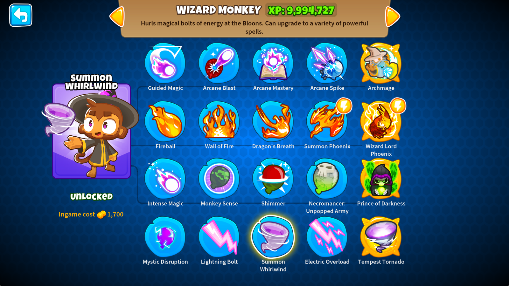

<h1 align="center">

Tornado Wizards

</h1>

A mods making use of [PathsPlusPlus](https://github.com/doombubbles/paths-plus-plus) to add an additional upgrade path for Wizards. 
The 5 new upgrades give them back lightning and tornado themed abilities they had in previous games that were instead shifted to Druids in BTD6.

